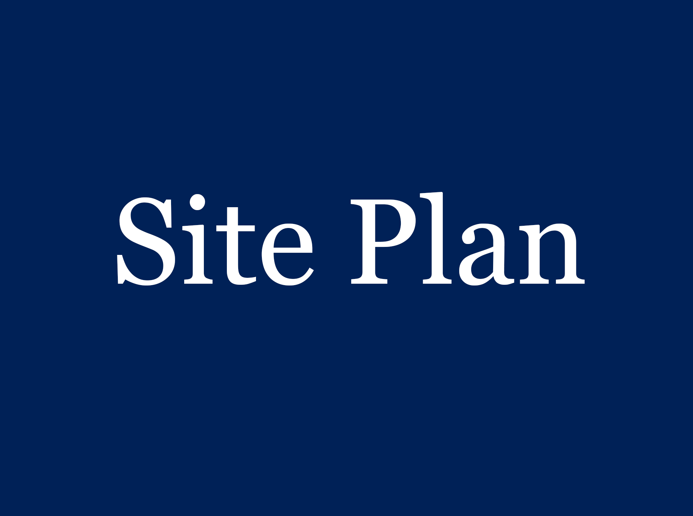

# Site Plan

Add your initial site plan for SP2, and any further revisions for SP5. Include commentary.

*Tutors will download the image to view the full size persona*.

## Original Site Plan

### Commentary
You have established this architecture following the card sort and tree testing. Explain the architecture that we now see.

---

>We would expect at least one further iteration, but don't adjust them for the sake of it. Your final version must reflect the architecture of the site (The Guide) that you submit at SP5.

## Site Plan v2

### Commentary
Detail your revisions. If it helps, highlight the changes on the site plan itself.

---

## Site Plan v3

### Commentary
Detail your revisions. If it helps, highlight the changes on the site plan itself.

